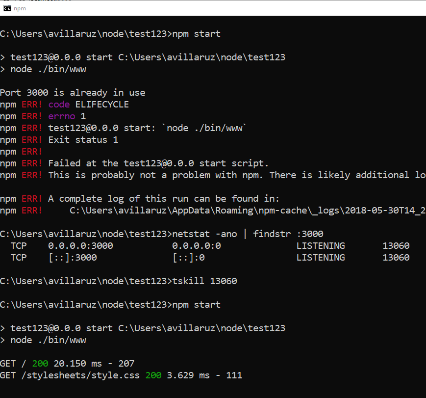

[Slide 3 - You asked](http://avillaruz.computerstudi.es/comp2068/week04/index.html#slide=3)
You asked: where does response and request come from? magically populated

[10,000 foot view GET](http://avillaruz.computerstudi.es/comp2068/week04/index.html#slide=4)

Show book chapter on [higher order fn](http://eloquentjavascript.net/05_higher_order.html)

Use [repl.it](https://repl.it) to code below:

Let's start with this code. Run it.

```js
for (let i = 0; i < 10; i++) {
  console.log(i);
}
```

Q. How would I abstract it so that I can make it loop n times?
A. Create a function called repeat(n)

```js
function repeat(n) {
  for (let i = 0; i < n; i++) {
    console.log(i);
  }
}

repeat(7);
```

Q. How would I abstract it so that instead of console.log being the function, I can pass in my own function in order to do something with i?
A. Pass a function in a function

```js
function repeat(n, myFunc) {
  for (let i = 0; i < n; i++) {
    myFunc(i);
  }
}

repeat(3, alert);
```

Or instead of alert/console.log try creating your own function

```js
function repeat(n, myFunc) {
  for (let i = 0; i < n; i++) {
    myFunc(i);
  }
}

repeat(3, function(x) {
  console.log(x * 2);
});
```

Q. So how did our x get populated?
A. x was prepopulated before my function was called (hence callback)

Get [create server code](https://github.com/avcoder/comp2068-week01/blob/master/02-helloworld.md)

```js
http.createServer(function(request, response) {
  console.log(request.url);
  response.writeHead(200);
  response.end('Our first node page');
});
```

Let's strip it down to its essentials

```js
createServer(function(request) {
  console.log(request.url);
});
```

So working backwards realize that req/res are being populated before my function is being called

* functions are OBJECTS too!!

```js
const http = {
  createServer: function createServer(myFunc) {
    let req = {
      url: '/about',
      host: 'www.domain.com'
    };

    const res = {
      send: function(msg) {
        console.log(msg);
      }
    };

    myFunc(req, res);
  }
};

http.createServer(function(request, response) {
  console.log(request.url);
  response.send('hi');
});
```

---

Q. What is role of request?
A. Debug in VS Code to see request object during GET request  (open /node/helloworld  )

[Slide How the MEAN stack fits](http://avillaruz.computerstudi.es/comp2068/week04/index.html#slide=5)
[MVC](http://avillaruz.computerstudi.es/comp2068/week04/index.html#slide=6)

* MVC is a design architecture to separate the logic, data, and visualization of an application
* views refer to our template engines. But we don't serve html files anymore because it doesn't support server side variables.
* models relate to db
* dispatcher - at a given url, do this
* controller is the logic

# Express
[Slide How the MEAN stack fits](http://avillaruz.computerstudi.es/comp2068/week04/index.html#slide=7)

[Express website](http://expressjs.com)

Node designed for network comm, not specifically for web

So far we've been creating webservers with Node `require('http')` and then `require('connect')` at a low level

[http vs connect](http://avillaruz.computerstudi.es/comp2068/week04/index.html#slide=8)

[connect vs express](http://avillaruz.computerstudi.es/comp2068/week04/index.html#slide=9)

Q. Spot any differences between connect and express?
A. fyi: res.send == res.end

[express defn](http://avillaruz.computerstudi.es/comp2068/week04/index.html#slide=9)

# Hello world using Express

[express defn](http://avillaruz.computerstudi.es/comp2068/week04/index.html#slide=10)

Q. What does '/' mean in app.get?

Q. What happens if I goto '/asdf' ?

Q. Why is error message GET? // default http method

[http verbs](http://avillaruz.computerstudi.es/comp2068/week04/index.html#slide=11)

## Show GET vs POST by creating a form

```html
<form action="/users/123" method="GET">
    <label for="name"></label>
    <input type="text" name="name">

    <label for="food"></label>
    <input type="text" name="food">

    <button type="submit">Submit</button>
</form>
```

1.  Try submitting some data without running a server. Notice URL is a GET request. As if we typed URL in the browser
1.  If POST, show my node/lab4 and debug to inspect request
1.  GET reads, POST creates, DELETE erases, PUT updates

* Can also use above to create APIs so that JSON data is passed instead of HTML

---

---

# Express generator to pre-build website

From now on we will use the express-generator to build all our apps

Install it globally `npm i -g express-generator`

Express will create an app.js, create a structure of folders, and default pages so as soon as we start the server we will have a functioning basic website

Run `express -h` to see options. There are a few different template engines which refer to 'Views'

* We will use [EJS](http://ejs.co). But can be used with a variety of HTML templating engines
* Show [jade example](http://jade-lang.com/). Show how [fussy indents are](https://naltatis.github.io/jade-syntax-docs/)
* by default express uses pug/jade so we have to say `-e` to use ejs. For example `express myapp -e` will create a folder called myapp and inside it will have the structure of folders, some default pages but using [ejs template engine](http://expressjs.com/en/starter/generator.html)

## Examine folder structure that Express built

public/ contains static files, images, client side js, css.  
routes/ this is the dispatcher. app.get('/', ...) app.post('/', ...) etc.

### views/index.ejs

* Notice it's mostly html. The <%> tags are like php.
* Where does the value of title come from? // provided in controller
* notice different kinds of tags [<% <%= <%-](http://ejs.co/)
* SHOW my lesson4-part2 express app for <%= vs <%-
* `<%= ... %>` Outputs server-side content, similar to the PHP echo command

### View routes/index.js

* Here's where the value of title comes from
* looks similar to what we did before
* the router allows us to dispatch urls
* new method called render. 1st parameter connects to equivalent filename.ejs
* 2nd parameter is just a js object. Can pass multiple values

## Pass another key/value in res.render()

```
<p><%= message %></p>
```

Refresh and error msg is "message is not defined". Fix:

```js
res.render('index', {
  title: 'Lesson 4',
  message: 'Hello world'
});
```

But where is the controllers?

## Create controllers folder

* Currently our logic is inside our routes folder, but we want to separate that into a controllers folder. More scalable, DRY principle if same code on a different route. Hard to test. So factor it out on its own controller. Each functional part of your app should have its own controller.

1.  Create folder called controllers
1.  Inside controllers/ create indexController.js

```js
/* indexController.js */
exports.homePage = (req, res) => {
  res.render('index');
};
```

```js
/* index.js */
const indexController = require('../controllers/indexController');

router.get('/', indexController.homePage);
```

* Since code/logic isn't directly tied to route anymore, we can reuse it for other routes if need be.
* Sometimes we'll have multiple middleware listed after indexController.homePage

---

---

# Assignment 1

* unveil/unhide in Bb
* Due in 2 parts. Part 1 due next Thursday. Part 2 due Thursday after. 2 weeks total. Good news, express generator will pre-build alot of it.
* Portfolio will be useful to you. Helps you get jobs. Employers want a portfolio, linkedIn and Github moreso than resume
* View sample portfolio or google [amazing developer portfolios](https://codeburst.io/10-awesome-web-developer-portfolios-d266b32e6154)
* Assignment must have 5 pages
* use express generator to build it, use ejs template engine
* use of app.get
* use of any css framework
* all of your content can be static ejs pages loaded with express routing; so no dynamic content needed, no db
* shared header/footer
* commiting to git
* deploying to a cloud service (azure or heroku)
* bonus marks: contact page, it doesn't have to work, but if you figure it out -- bonus!
* bonus: put it under your own site, employers ask for this, how to register for a domain, how to get it online etc.
* cite where external code came from, email me to check
* So for part 1 - get started, use generator and set up your 5 views, at least 3 commits to github (not within 15 minutes)
* so if I download and run it, I can view each page. no styles needed
* big idea: you'll use this to job seek
* can create videos of non-web/IoT projects too - comm skills

# How does our app know to go to these .js files in routes/

* view app.js - more complex, more deps
* Add comment // links to our controllers or route files above `var routes = require...`
* `const app = express();` Creates a new instance of an express application so that it can be configured
* When we say res.render how does it know where to look for index? `app.set('views', path.join(__dirname, 'views'));`
* Here is where we use -e `app.set('view engine', 'ejs');`
* didn't have to specify css file located in public since `app.use(express.static(path.join(__dirname, 'public')));`
* Add comment // Attach index.js to '/' `app.use('/', routes);`
* error handling
* making file public `module.exports = app;`

## From incoming request to ejs webpage : the flow

* incoming request hits app.js (client)
* index.js (dispatcher)
* indexController.js (controller)
* index.ejs (view)

## Create route: randomNumber

Create random.ejs in views folder

```
<h1><%= title %></h1>
<p><%= randomNumber %></p>
```

But there's no way to load this right now. Also how to pass randomNumber?
Q. Which file could we go to to add this path?

In routes/index.js

```js
router.get('/random', (req, res, next) => {
  // calc random number
  const someNumber = Math.random();

  // display page and pass data
  res.render('random', {
    title: 'random',
    randomNumber: someNumber
  });
});
```

* could have used same variable name for randomNumber
* Assignment 1 asks for 5 views

# Creating partials

* Inside of views/ create partials/ folder (similar to PHP)
* Inside of partials/ create header.ejs and footer.ejs
* Q. What should I remove? Cut and paste appropriate html sections from index.ejs and paste into header and footer
* in index.ejs, replace what you cut with <% include partials/header %> and <% include partials/footer %>

# Add a CSS framework

* I'm going to use getmdl.io
* For your lab I've given you another option to use for bonus marks. No bootstrap.

```html
<link rel="stylesheet" src="/stylesheets/whatever.css" />
```

* you need the leading slash before stylesheets

# Deployment

* Upload current code to Github /comp2068-lesson4-part2
* most internet hosting companies don't support node. Only cloud services do (Digital Ocean, Amazon, heroku, google, azure)

How is cloud hosting different from traditional hosting?

* Benefits are scalability due to on demand servers, faster performance, cheaper since it's pay per use
* traditional hosting is if you reach a certain bandwidth, you get charged, and people are waiting, you don't get more bandwidth
* we get demand spikes which means we have to buy enough servers to always meet that maximum which is expensive on a monthly basis
* clouds - if server is loaded, it automatically spins up another server, then turns off if low usage. So don't have to buy hardware.
* there aren't many cloud hosting companies since you have to have plenty of data centers
* heroku gives us 5 free apps we can upload

1.  Login to heroku.com
1.  Click New
1.  Give your app a name gcxxx-lesson4
1.  Deploy via Github
1.  Enable automatic deploys
1.  Click Deploy Branch
1.  View website

* Show how auto deploy works (add a user name to array)
* Show how Activity tab in heroku dashboard can roll back to previous version

# Lab 4

* Use express generator to make mini-express site where each person in your family gets their own page and tell me something about them
* no styles needed. Yes - upload to heroku
* show example
* if you do lab4, assignment 1 is just a bigger version of it
* for assignment 1 part 1, aim to do

# What is package-lock.json? [Answer](https://docs.npmjs.com/files/package-lock.json)

# error msg if running port 3000 twice. ()
